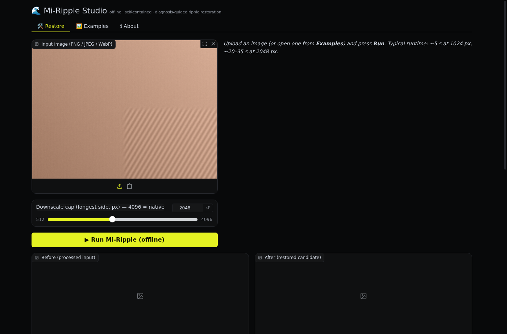
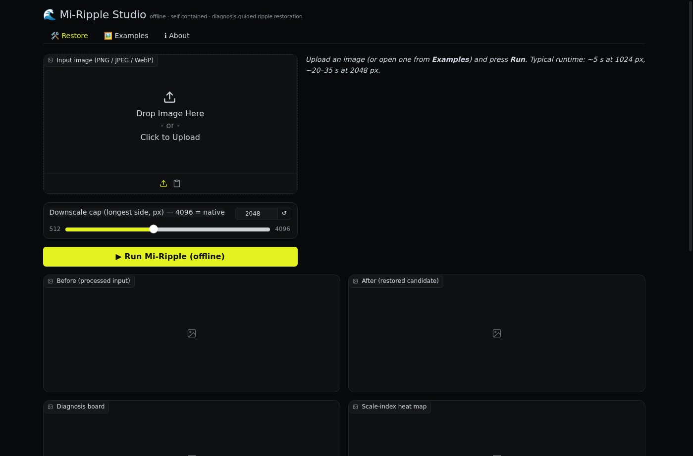

# Mi-Ripple Studio

**A fully self-contained, offline-only desktop app for [Mi-Ripple](https://github.com/miyang-ai/Mi-Ripple)** —
MIYANG's diagnosis-guided restoration of *digital ripple artifacts* (grid-like, scale-like,
granular patterns) introduced by iterative, reference-conditioned AI image editing.

Mi-Ripple Studio wraps the MIT-licensed Mi-Ripple pipeline in a **Gradio** interface,
frozen into a local Python server, and hosted inside its own **Electron (Chromium)**
window. There is no Python install, no Node runtime, no server, and — by design —
**no network access at all**. The interface is a dark "midnight precision
instrument" theme (Linear-inspired): near-black surfaces separated by hairline
borders, a single acid-lime accent for the one primary action, and system fonts
only — so it stays crisp on every display and makes zero external font requests.

| Restore tab (example loaded, ready to run) | Desktop app |
| --- | --- |
|  |  |

```
┌────────────────────────────────────────────────────────────────┐
│  Electron shell (Chromium)                                     │
│  ┌──────────────────────────────────────────────────────────┐  │
│  │  Gradio UI  (http://127.0.0.1:<random port>)             │  │
│  │  ┌────────────────────┐   ┌────────────────────────────┐ │  │
│  │  │ Restore   (run)    │   │ Examples  (bundled demos)  │ │  │
│  │  └────────────────────┘   └────────────────────────────┘ │  │
│  └──────────────┬───────────────────────────────────────────┘  │
│                 ▼                                              │
│  Frozen Mi-Ripple backend (PyInstaller, vendored mi_ripple)    │
│  diagnose → treat (masked spatial / spectral notch) → verify  │
└────────────────────────────────────────────────────────────────┘
```

## What it does

Upload an image, press **Run**, and the deterministic Mi-Ripple pipeline:

1. **Diagnoses** the image — periodic lattice peaks, 3–8 px granular texture,
   scale-like tiling, with heat maps and inspection boards.
2. **Treats** it the least-invasive way the diagnosis justifies — strict
   masked spatial reduction for flat-region granules, selective spectral
   notching for isolated periodic peaks.
3. **Verifies** the result against the original (aligned-distortion gates,
   structure/face protection via OpenCV Haar cascades) and rolls back when
   verification fails.
4. **Delivers** a candidate plus a complete **evidence pack** (diagnosis JSON,
   heat maps, masks, verification boards, XML decision trace, hashes) you can
   download as a zip.

Outcomes you may see:

| Outcome | Meaning |
| --- | --- |
| ✅ `delivered` | Restored candidate produced. It is a *candidate* — accept it yourself after reviewing the boards. |
| ⚠️ `delivered_with_verify_failure` | The masked granule reduction failed verification; the pipeline rolled back to the low-distortion notch-only candidate. |
| 🔶 `needs_human_decision` | Artifacts are entangled with real content (hair, foliage, fabric…). The offline deterministic route stops here by design. |
| ❌ `failed` / step limit | Pipeline error or step budget exhausted — see the XML trace. |

### Offline note

- No telemetry, no analytics, no external font/CDN requests, no auto-updates.
  The Chromium shell is additionally configured to **block all DNS resolution**
  except loopback, so nothing can leave the machine.
- Mi-Ripple's *optional* regeneration route (paid MIYANG API, network required)
  is **disabled** in this build. When the pipeline stops with
  `needs_human_decision`, that is expected offline behaviour — the evidence
  pack is yours to review.

> ⚠️ This is a research implementation, not a universal artifact detector.
> Automatic scores are **triage signals**. Review the generated heat maps and
> comparison boards before accepting any output.

## Using the app

1. Install / run the packaged app for your OS (see *Building* below).
2. The **Restore** tab: upload a PNG/JPEG/WebP (or paste from clipboard), set
   the downscale cap for very large images (default 2048 px; 4096 = native),
   and press **Run**. Typical runtime: ~5 s at 1024 px, ~20–35 s at 2048 px.
3. The **Examples** tab: four deterministic synthetic ripples (lattice,
   granules, texture, clean control) plus curated before/after reference
   assets from the Mi-Ripple project — click a thumbnail or use the dropdown +
   **Open in Restore**. A generator creates new synthetic examples (type,
   amplitude, seed).
4. Download the **evidence pack** zip from the Restore tab after each run.

### Where your data lives

Runs, work files, generated examples and logs are stored in
`%APPDATA%\Mi-Ripple Studio\` (never uploaded anywhere).
Logs: `%APPDATA%\Mi-Ripple Studio\logs\studio.log`.

## Getting the Windows app

### Option A — no local compiling (GitHub Actions)

The repo ships a GitHub Actions workflow that builds the installer on
Microsoft's Windows runners, so you don't need any toolchain yourself:

1. Push this folder to a GitHub repository.
2. **Actions** tab → **Build Windows installer** → **Run workflow**
   (it also runs automatically on every push to `main`/`master`).
3. When the job finishes, download the **Mi-Ripple-Studio-Windows-x64**
   artifact — the `.exe` in it is the finished installer.

### Option B — build locally on Windows (one command)

Prerequisites: **Python 3.11+** (64-bit), **Node.js 20+**, network access
*at build time only* (the built app is offline).

```powershell
git clone <this project>; cd mi-ripple-studio
powershell -ExecutionPolicy Bypass -File build\build_windows.ps1
```

Artifact: `electron\dist\Mi-Ripple Studio-<ver>-win-x64.exe` (NSIS installer).

> Why a build step at all? The app freezes a Python/Gradio backend with
> PyInstaller, which **cannot cross-compile** — a Windows binary must be
> built on Windows. Once built, running the app needs nothing.

### Development mode (no packaging, Windows or any OS)

```powershell
python -m venv .venv
.venv\Scripts\pip install -r app\requirements.txt
# terminal 1 — the Gradio app
.venv\Scripts\python app\gradio_app.py --port 7860
# terminal 2 — the Electron shell (auto-finds the venv backend)
cd electron; npm install; npm start
```

## Project layout

```
mi-ripple-studio/
├── app/
│   ├── gradio_app.py        # the Gradio UI + dark theme + offline hardening
│   ├── mi_ripple/           # vendored Mi-Ripple source (MIT, unchanged)
│   ├── requirements.txt     # pinned dependency ranges
│   └── LICENSE / TRADEMARKS.md
├── electron/
│   ├── main.js              # shell: spawns backend, waits for READY,
│   │                        #   opens window, blocks all non-loopback traffic
│   ├── preload.js
│   ├── package.json
│   └── electron-builder.yml # Windows packaging: backend + examples as extraResources
├── build/
│   ├── server.spec          # PyInstaller spec (full web-stack import closure)
│   └── build_windows.ps1    # one-command Windows build
├── .github/workflows/
│   └── build-windows.yml    # builds the installer on GitHub's Windows runners
├── examples/
│   ├── real/                # curated before/after assets (Mi-Ripple repo)
│   └── synthetic_*.png      # generated on first launch if absent
└── assets/                  # app icon + screenshots
```

## How the offline guarantees are enforced

1. `GRADIO_ANALYTICS_ENABLED=False` + `analytics_enabled=False` — no Gradio telemetry.
2. The served page is rewritten at startup (and as an ASGI fallback) to remove
   Gradio's Google-Fonts preconnects and the CDN iframe-resizer script; the
   theme uses system font stacks only.
3. Chromium runs with `host-resolver-rules: MAP * ~NOTFOUND, EXCLUDE 127.0.0.1`
   — every name lookup except loopback fails at the resolver level.
4. `webRequest.onBeforeRequest` cancels any request that isn't
   `127.0.0.1`/`localhost`/`data:`/`blob:`.
5. The pipeline runs with `allow_regen=False`; the network-using regeneration
   client is never constructed.

## Troubleshooting

- **Window shows the spinner forever** — open
  `%APPDATA%\Mi-Ripple Studio\logs\studio.log`; the backend's stderr tail is
  logged there. Port allocation is automatic (random free loopback port).
- **Windows SmartScreen** — the build is unsigned; use *More info → Run
  anyway*. (Code-signing is left to the integrator; add `CSC_*` env vars to
  the builder for a signed build.)
- **Antivirus false positives on the frozen backend** — PyInstaller bundles
  are occasionally flagged. A custom PyInstaller bootloader/sig or code signing
  resolves this.
- **Installer fails to build locally** — make sure Python 3.11+ and Node 20+
  are on PATH and that the machine has disk space for the ~650 MB frozen
  backend and ~2 GB of electron-builder staging (the script stages in
  `.tmp-build\` at the repo root).
- **Very large images are slow** — lower the *Downscale cap* slider; the
  pipeline is O(N) in pixels.

## License & credits

- **Mi-Ripple** — © 2026 MIYANG Technology (Shanghai) Co., Ltd., **MIT License**
  ([source](https://github.com/miyang-ai/Mi-Ripple)). *MIYANG, its logo, and
  associated product branding are trademarks of MIYANG Technology (Shanghai)
  Co., Ltd.; this unofficial community shell does not grant rights to those
  marks.*
- **Gradio** — © Hugging Face, **Apache-2.0**.
- **Electron** — © Electron contributors, **MIT**.
- Everything in this repository that is not vendored from the above is **MIT**.

## Method reference

Paper: Yicheng Xu, Jiayin Chen, and Muting Wang. *Mi-Ripple: Restoring Images
Degraded by Iterative AI Editing.* MIYANG Technology (Shanghai) Co., Ltd.,
2026. See the Mi-Ripple repository for the full paper, algorithm docs and
limitation notes.
